# homework-SElinux

Описание домашнего задания
---
1. Запустить nginx на нестандартном порту 3-мя разными способами
2. Обеспечить работоспособность приложения при включенном selinux

---
- Этап 1: Запустить nginx на нестандартном порту 3-мя разными способами

 **Gереключатели setsebool**

ОС для настройки: almalinux v9.3.20231118

Vagrant версии 2.4.1

VirtualBox версии 7.0.18

Ansible версии 2.10.8

Поднимаем виртуальную машину из бокса с помощью Vagrant (хотя, можно было и на основной машине попробовать)

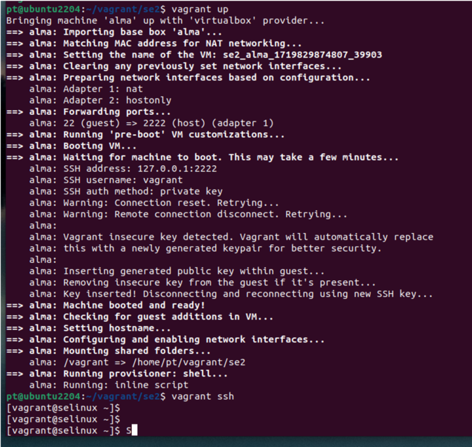

Устанавливаем nginx и epel-release (мне нравится руками)

```bash
yum install -y nginx
yum install -y epel-release
```  

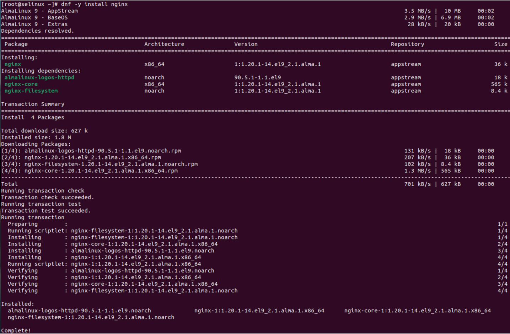
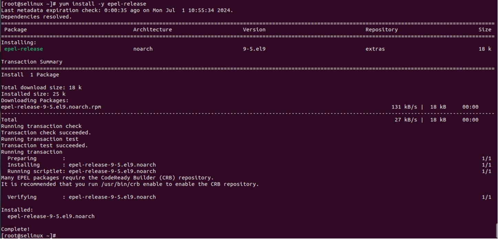

Меняем порт на nginx (я выбрал 8088). Файл конфигурации

```bash
/etc/nginx/nginx.conf
```  

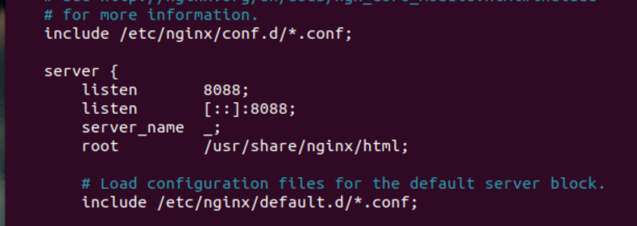


Пытаемся запустить, ловим ошибку

```bash
systemctl start nginx
```  

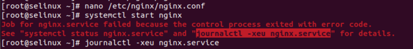


Заглянем в журнал, что предлагается в подсказке. 

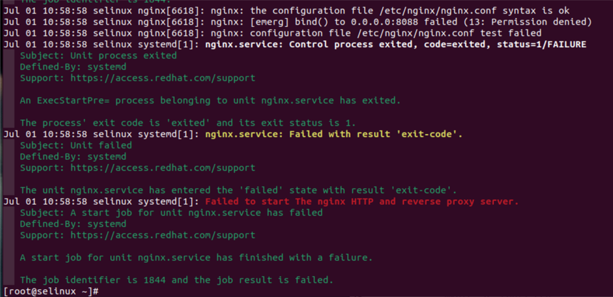

И посмотрим статус. 

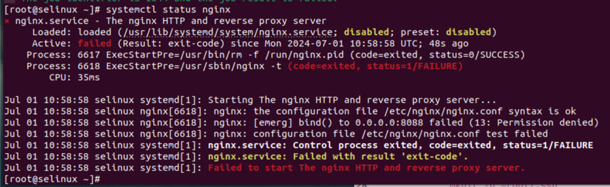


Глянем, слушает ли хоть кто-то наш порт (не, ну мало ли) 

```bash
ss -tlpn | grep 8088
```  

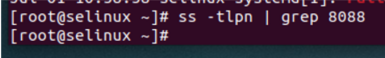


Проверим, может сетевой экран блокирует, или допущена ошибка в конфигурации, чтобы исклчить очевидные возможные проблемы 

```bash
systemctl status firewalld
nginx -t
```  

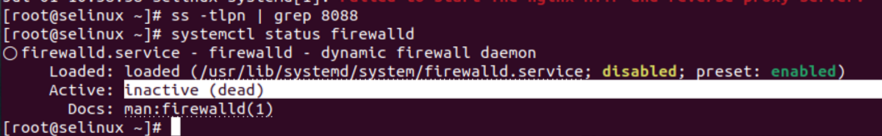
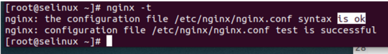


С данными настройками все хорошо, проблема не в них. Смотрим, включен ли виновник этого ДЗ - SElinux 

```bash
getenforce 
```  

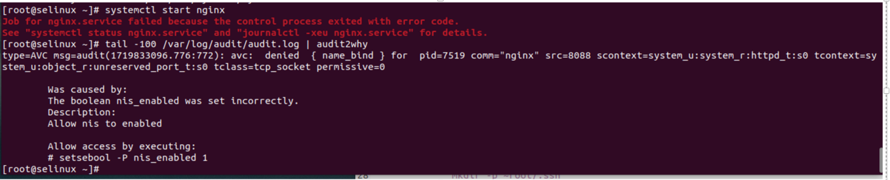


Дальше для более детального "ковыряния" SElinux пришлось устанавливать доп пакеты (комментарий автора - это очень странно, что надо
доставлять пакеты, не могли сразу что ли сами поставить, я полчаса искал, где отрыть audit2why, но интернет весьма скуп почему-то. в итоге подсмотрел в лекции, какие пакеты доставлялись)

```bash
yum install setroubleshoot-server
yum install selinux-policy-mls
yum install setools-console
yum install policycoreutils-newrole
```  

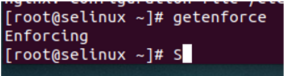

Данная утилита подсказывает решение нашей проблемы, а именно, изменение параметра nis_enabled

```bash
# включаем параметр
setsebool -P nis_enabled on
# ребутаем сервис
systemctl restart nginx
# теперь снова проверяем статус
systemctl status nginx
```  

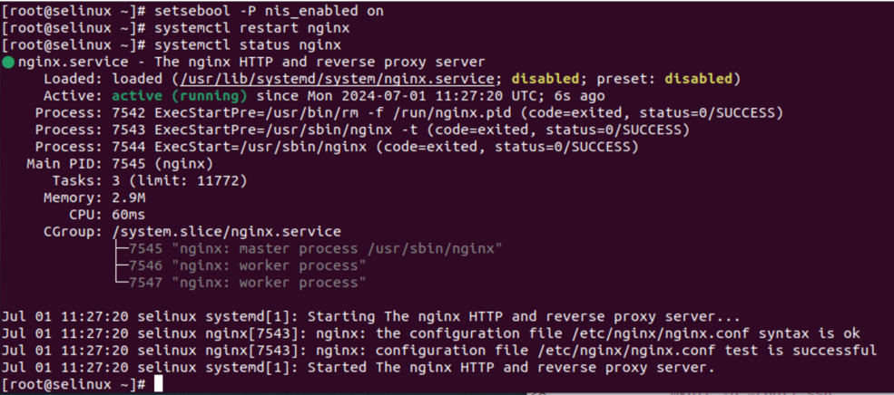


Сервис активный, Дополнительно проверяем его доступность по запросу (тут я тупил 5 минут, потому что забыл, что это виртуалка, и запрос отправлял в браузер основной машины :D ) Курл пришлость доставить.. 

```bash
curl http://127.0.0.1:8088
```  

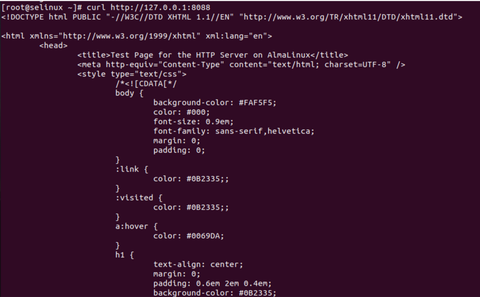


```bash
# Проверяем статус параметра
getsebool -a | grep nis_enabled
# выключаем его
setsebool -P nis_enabled off
# перезапускаем сервис (чтобы опять ошибку словить и попробовать иные способы)

```  

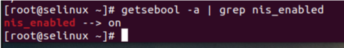
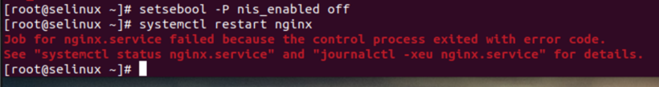


**Еще один вариант - добавить нестандартый порт в имеющийся тип**.

```bash
# Для начала посмотрим, к какому типу относится порт, на котором по дефолту крутится сервис
semanage port -l | grep http
```  

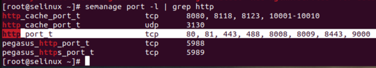


```bash
# Добавляем наш порт в этот тип
semanage port -a -t http_port_t -p tcp 8088
# Перезапускаем сервис, проверяем
# И еще раз убедимся, что новый порт добавлен к типу
semanage port -l | grep  http_port_t
```  

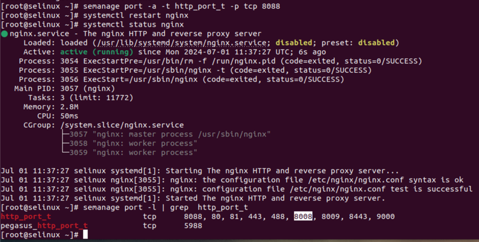


```bash
# Все ок. Удалим порт из типа и перезапустим сервис
semanage port -d -t http_port_t -p tcp 8088
```  

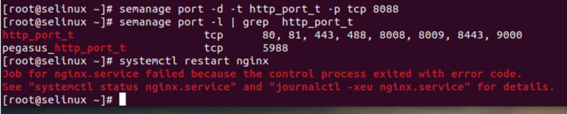


**Еще один вариант - сформировать модуль.**

```bash
# утилита audit2allow позволит на основе логов SELinux сделать модуль, разрешающий работу nginx на нестандартном порту (классная вещь)
grep nginx /var/log/audit/audit.log | audit2allow -M nginx
```  

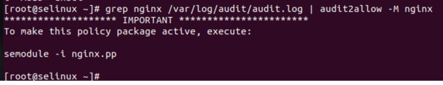


```bash
# применим подуль и проверим его работу. Все отлично работает. 
semodule -i nginx.pp
```  

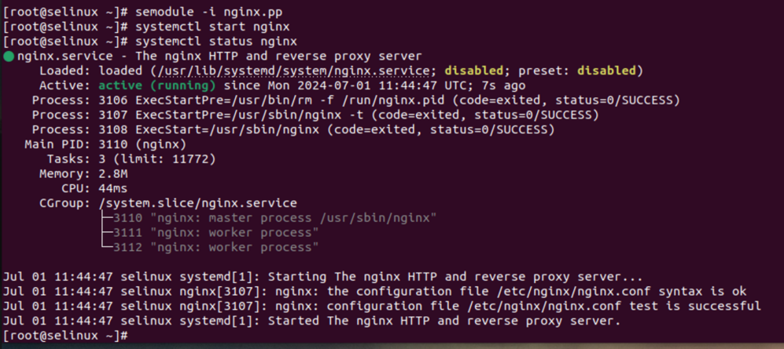

```bash
# Для удаления модуля:
semodule -r nginx
# Посмотреть все установленные модули:
semodule -l
```  

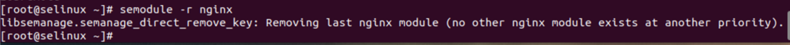

---
- Этап 2: Обеспечить работоспособность приложения при включенном selinux

Тут был трындец... Все делалось по заданию, был склонировал репозиторий, все хорошо, но при попытке запуска виртуалок получал следующую ошибку (на скрине с клиентом, но аналогично и с сервером было, просто к моменту скрина я уже решил проблему)

```bash
# копирование репозитория
git clone https://github.com/mbfx/otus-linux-adm.git

vagrant up
```  
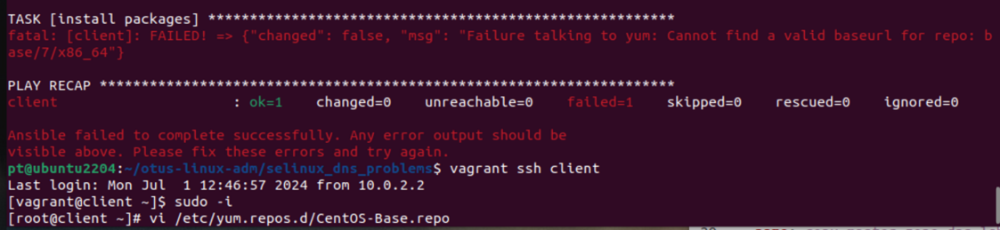


Видно, что не очень дела с репозиторием, ок. Порылся в плейбуке, там устанавливается другой, но он тоже не ставился руками. 
В итоге пришлось заходить на виртуалку (сама по себе она поднялась), править руками файл, куда ОС смотрит и откуда беерт репо, только после этого все отработало. Ниже указано, где менять и что, а так же краткая инструкция по vi, потому что обычно я пользуюсь nano
но nano не устанавливался без репо, а скачивать отдельный пакет мне хотелось еще меньше

```bash
# лезем в файл:
sudo vi /etc/yum.repos.d/CentOS-Base.repo
# Меняем все репы на рабочий http://mirror.yandex.ru/centos/7/os/x86_64/

# тыкаем i, чтобы перейти в режим редактирования
# Важно поменять репу для **baseurl**
# НЕ ЗАБУДЬ СНЯТЬ КОММЕНТАРИЙ С baseurl
# нажимаем esc, чтобы выйти из режима редактирования
# вводим **:wq**
# потом еще надо кэш обновить
sudo yum clean all
sudo yum makecache
```  
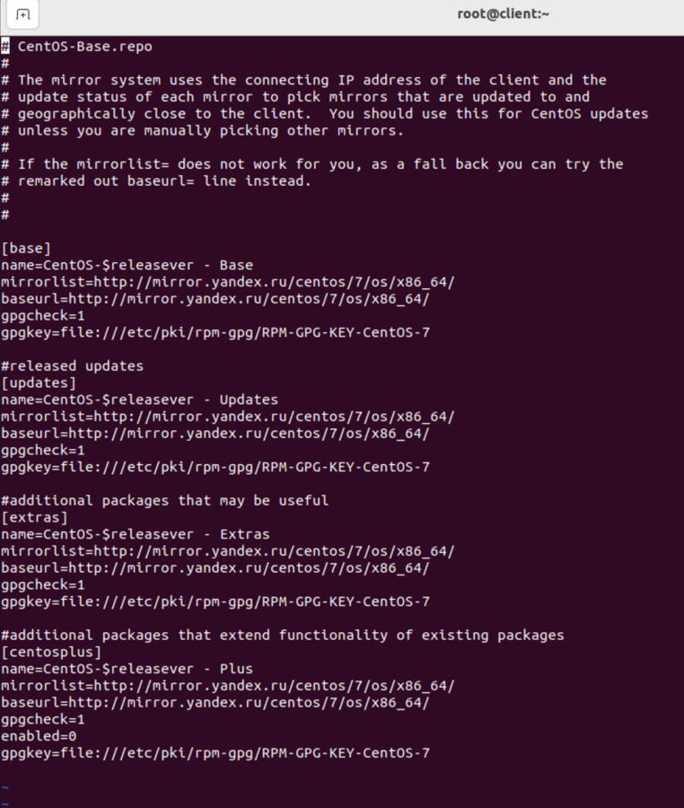


Пакеты подгрузились

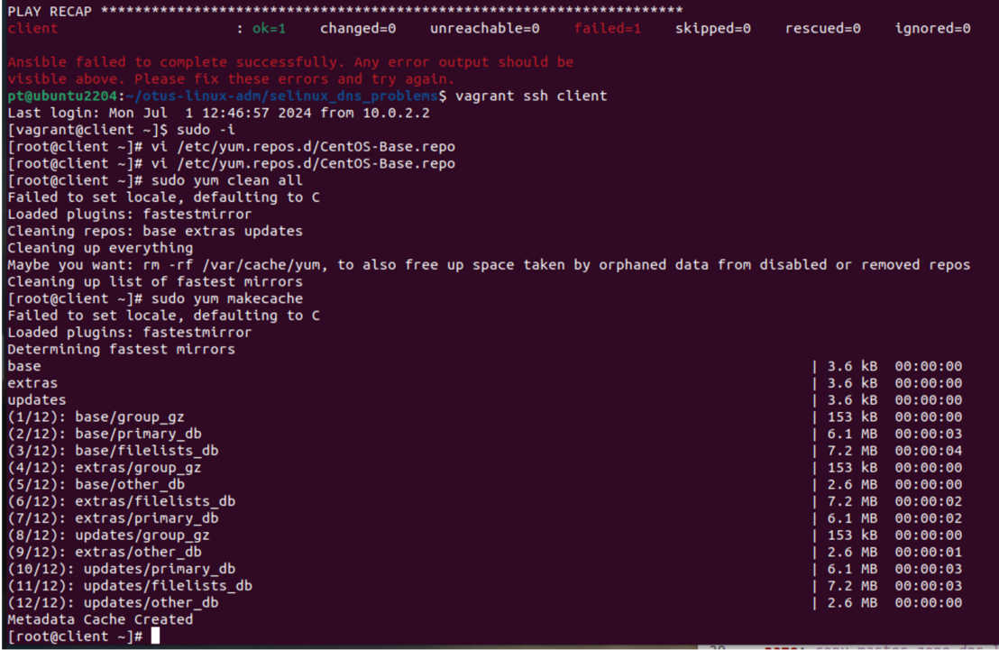


Теперь выходим из ВМ и запускаем еще раз, только уже достаточно vagrant provision

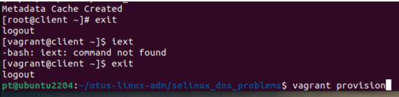
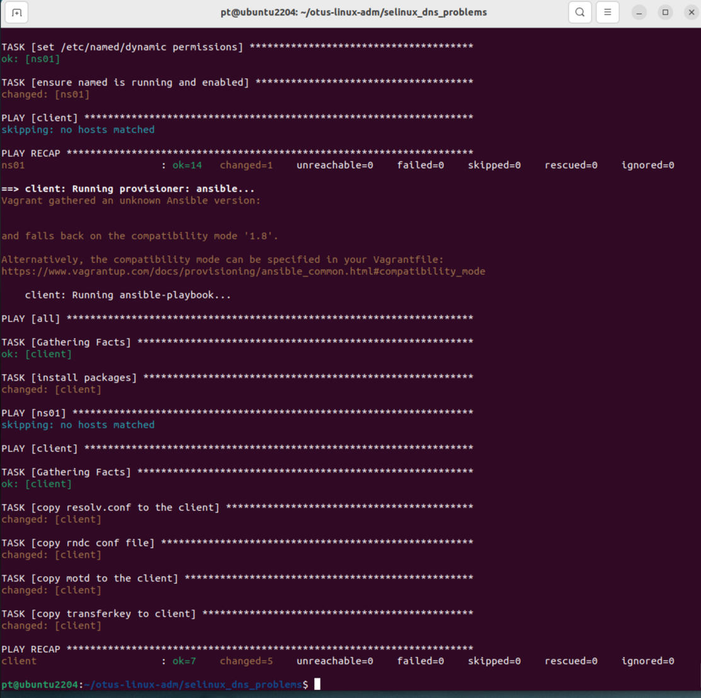
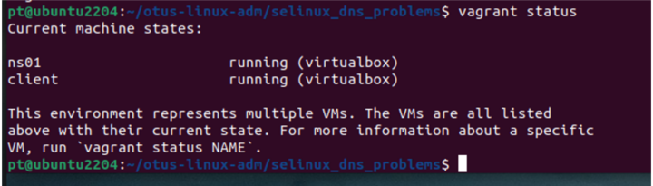


Можно приступать к работе. Подключаемся к клиенту и пробуем внести изменения в зону.

```bash
nsupdate -k /etc/named.zonetransfer.key
> server 192.168.50.10
> zone ddns.lab
> update add www.ddns.lab. 60 A 192.168.56.15
> send
```  
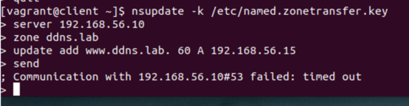


Но ошибку не получаем, отваливаемся по таймауту... Проверяем, что есть сетевая доступность, смотрим логи SELinux, но все равно не находим там ничего, что должны были бы найти..

```bash
# это ошибки посмотреть
cat /var/log/audit/audit.log | audit2why
```  
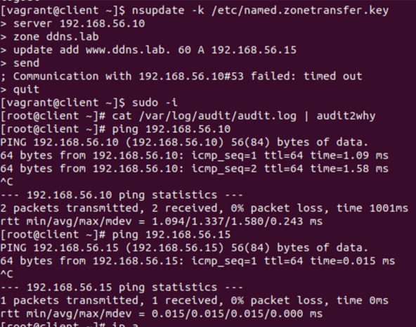
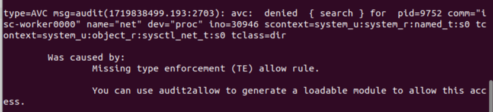

Где-то через 20 минут я вспоминаю\понимаю, что зря поменял ip адреса в вагрант файле. (ну или не зря, зато узнал, где они еще прячутся). 

Эти адреса еще зашиты как минимум (на сервере) в 

```bash
/etc/named.conf
```  
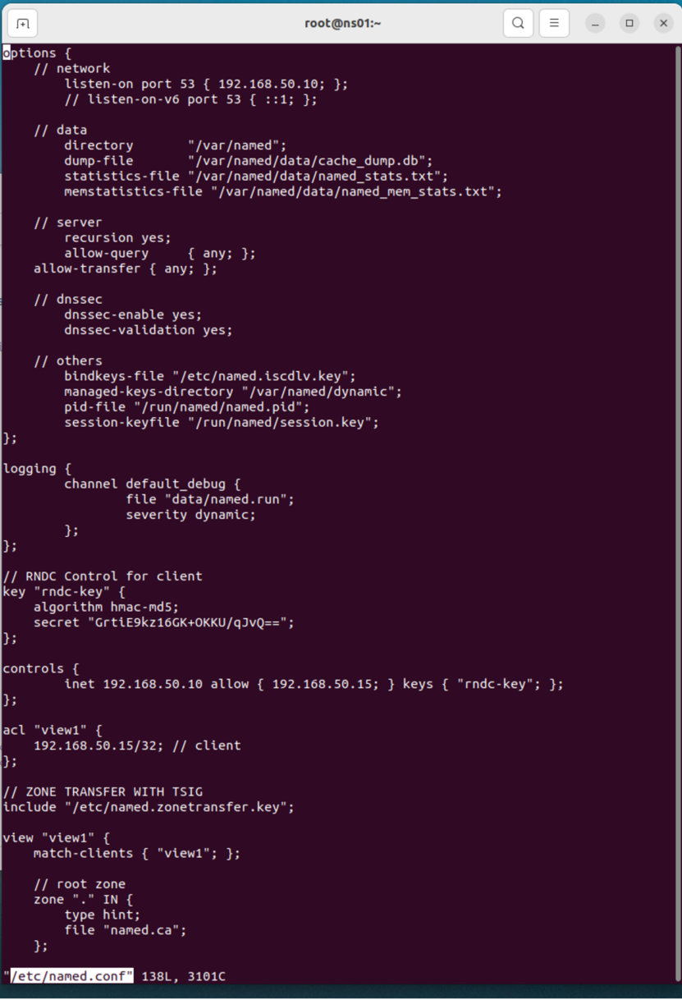


Решил поменять адреса руками, все-таки, стенд настроен, мало ли где еще я в это упрусь 

```bash
vi /etc/sysconfig/network-scripts/ifcfg-eth1
sudo systemctl restart network
# И вот теперь реально получаем ошибку!
```  
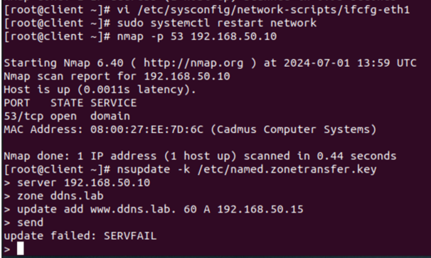


```bash
# И вот теперь в журнале то, что надо
```  
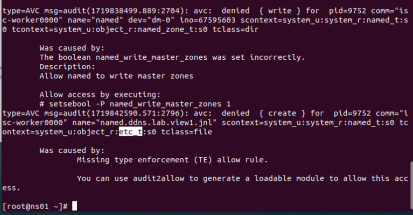


Смотрим контекст безопасноси, основываясь на логах ошибки 

```bash
ls -laZ /etc/named
# он не тот, что нам нужен
```

*Проблема заключается в том, что конфигурационные файлы лежат в другом каталоге. Посмотреть в каком каталоги должны лежат файлы, чтобы на них распространялись правильные политики SELinux, можно с помощью команды: 
```bash
sudo semanage fcontext -l | grep named
```


Изменим тип контекста безопасности для каталога /etc/named 

```bash
sudo chcon -R -t named_zone_t /etc/named
```


Но у меня опять не получилось внести изменения со стороны клиента.. Решил попробовать исправить проблему, которая была еще в логах, помимо той, что надо было увидеть.

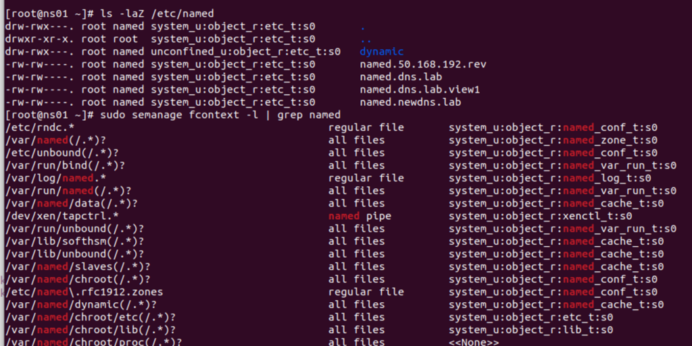

Ну а коль решение предалгается прям там, почему бы не попробовать его выполнить?)  

```bash
setsebool -P named_write_master_zones 1
systemctl restart named
# И это исправило ситуацию, теперь можно внести изменения со стороны клиента
```

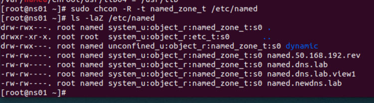

```bash
# Ребутаем, проверяем, что все работает - запрос со стороны клиента, видим указываемый нами ip адрес
dig @192.168.50.10 www.ddns.lab
```
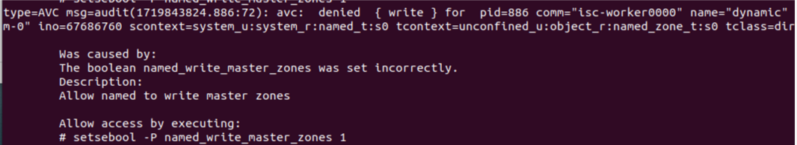

```bash
# Если надо вернуть правила обратно
restorecon -v -R /etc/named
```


---
- Этап 3: Уменьшить том под / до 8G
Подготовка временного тома для / раздела


```bash
pvcreate /dev/sda
vgcreate vg_root /dev/sda
lvcreate -n lv_root -l +100%FREE /dev/vg_root
```


Создание файловой системы и монтирование раздела для дальнейшего переноса данных
```bash
mkfs.xfs /dev/vg_root/lv_root
```


```bash
mount /dev/vg_root/lv_root /mnt
```


Копирование всех данных с / раздела в /mnt, проверка
```bash
xfsdump -J - /dev/VolGroup00/LogVol00 | xfsrestore -J - /mnt
ls /mnt
```


Сконфигурируем grub, чтобы при старте перейти в новый /.
Сымитируем текущий root, сделаем в него chroot и обновим grub:

```bash
for i in /proc/ /sys/ /dev/ /run/ /boot/; \
 do mount --bind $i /mnt/$i; done
chroot /mnt/
```


Обновим образ initrd. 

```bash
cd /boot ; for i in `ls initramfs-*img`; \
do dracut -v $i `echo $i|sed "s/initramfs-//g; \
s/.img//g"` --force; done
```


Чтобы при загрузке был смонтирован нужный root в файле /boot/grub2/grub.cfg заменяем 
```bash
rd.lvm.lv=VolGroup00/LogVol00
```
на 
```bash
rd.lvm.lv=vg_root/lv_root
```


```bash
lsblk
```


Изменяем размер старой VG и возвращаем на него рут:
Для этого удаляем старый LV и создаём новый:
```bash
lvremove /dev/VolGroup00/LogVol00
#Стоит отметить, что вот тут надо было обязательно выйти из супер режима и перезагрузиться, иначе было вот так 
```


```bash
lvcreate -n VolGroup00/LogVol00 -L 8G /dev/VolGroup00
# для наглядности я делаю вывод lsblk
```


Создаем ФС
```bash
mkfs.xfs /dev/VolGroup00/LogVol00
```


```bash
#монтируем 
mount /dev/VolGroup00/LogVol00 /mnt 
# и копируем
xfsdump -J - /dev/vg_root/lv_root | \
xfsrestore -J - /mnt
```


Сконфигурируем grub, за исключением правки /etc/grub2/grub.cfg

```bash
for i in /proc/ /sys/ /dev/ /run/ /boot/; \
 do mount --bind $i /mnt/$i; done
chroot /mnt/
grub2-mkconfig -o /boot/grub2/grub.cfg
```


```bash
cd /boot ; for i in `ls initramfs-*img`; do dracut -v $i `echo $i|sed "s/initramfs-//g; s/.img//g"` --force; done
```


---
- Этап 4: Выделить том под /var в зеркало

На свободных дисках создаем зеркало:

```bash
pvcreate /dev/sdd /dev/sdc
vgcreate vg_var  /dev/sdd /dev/sdc
```


```bash
lvcreate -L 950M -m1 -n lv_var vg_var
```


Создаем на нем ФС и перемещаем туда /var:
```bash
mkfs.ext4 /dev/vg_var/lv_var
```


```bash
mount /dev/vg_var/lv_var /mnt
cp -aR /var/* /mnt/
```


На всякий случай сохраняем содержимое старого var
```bash
mkdir /tmp/oldvar && mv /var/* /tmp/oldvar
```
Монтируем новый var в каталог /var:
```bash
umount /mnt
mount /dev/vg_var/lv_var /var
```


Правим fstab для автоматического монтирования /var:
```bash
echo "`blkid | grep var: | awk '{print $2}'` \
 /var ext4 defaults 0 0" >> /etc/fstab
```


Перезагружаемся в новый (уменьшенный) root


И удаляем временную Volume Group: 
```bash
lvremove /dev/vg_root/lv_root
vgremove /dev/vg_root
pvremove /dev/sdb
```


---
- Этап 5: Выделить том под /home

Выделяем том под /home по тому же принципу что делали для /var:
```bash
lvcreate -n LogVol_Home -L 2G /dev/VolGroup00

mkfs.xfs /dev/VolGroup00/LogVol_Home
mount /dev/VolGroup00/LogVol_Home /mnt/
cp -aR /home/* /mnt/
rm -rf /home/*
umount /mnt
mount /dev/VolGroup00/LogVol_Home /home/
```


Правим fstab для автоматического монтирования /home:
```bash
echo "`blkid | grep Home | awk '{print $2}'` /home xfs defaults 0 0" >> /etc/fstab
```


---
- Этап 6: Работа со снапшотами

Генерируем файлы в /home/:
```bash
touch /home/file{1..20}
```
Снимаем  снапшот:
```bash
lvcreate -L 100MB -s -n home_snap /dev/VolGroup00/LogVol_Home
#были некоторые сложности с путём
```


Удаляем часть файлов:
```bash
rm -f /home/file{11..20}
```
Процесс восстановления из снапшота:
```bash
umount /home
lvconvert --merge /dev/VolGroup00/home_snap
```


*ПРИМЕЧАНИЕ
```bash
mount /home
# А вот тут возник косяк. Не хотел монтироваться /home
#>>>mount: can't find /home in /etc/fstab
# Проблема оказалась в ошибке в команде, когда мы 
# Вносим изменения в fstab (упустил слеш)
# Хотел попробовать примонтировать по UUID, увидел косяк, поправил руками

mount /home
ls -al /home
```

